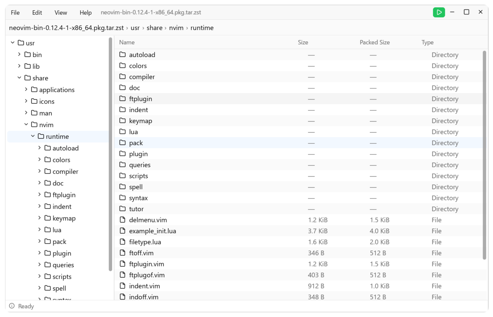

# Pulp

Pulp is a Linux archive manager with a command-line interface and a GPUI desktop application. Both applications use the same Rust archive library.



## Archive engine

Pulp embeds the official [7-Zip SDK](https://github.com/ip7z/7zip), specifically its [`Format7zF` bundle](https://github.com/ip7z/7zip/tree/main/CPP/7zip/Bundles/Format7zF).

`Format7zF` is a handler bundle rather than a new algorithm; Pulp delegates compression and decompression to the SDK's archive handlers and codecs, such as LZMA/LZMA2 where applicable.

The Rust library uses this provider for format detection, listing, testing, extraction, and archive creation, including split-volume and password-protected archives.

> [!NOTE]
>
> The native build currently targets Linux only.

## Build

The 7-Zip SDK is a Git submodule, so initialize it before building:

```bash
git submodule update --init --recursive
cargo build --workspace --release
```

Run the applications locally with:

```bash
cargo run -p pulp-cli -- --help
cargo run -p pulp-ui
```

- `pulp-cli` for terminal workflows
- `pulp-ui` built with [gpui](https://gpui.rs/) and [gpui-component](https://longbridge.github.io/gpui-component/)
- A small C/C++ ABI bridge for the native archive engine

## License

Unless otherwise stated, Pulp's original source code is released under the MIT License; see [LICENSE](LICENSE).

Third-party dependencies and the embedded 7-Zip `Format7zF` SDK are not relicensed under MIT and retain their upstream terms. The SDK includes LGPL-2.1-or-later and BSD-licensed components, as well as the unRAR restriction for RAR decompression. See [THIRD_PARTY_NOTICES.md](THIRD_PARTY_NOTICES.md) and the upstream notices in [`crates/pulp/native/sdk/DOC/`](crates/pulp/native/sdk/DOC/) before redistributing binaries.
